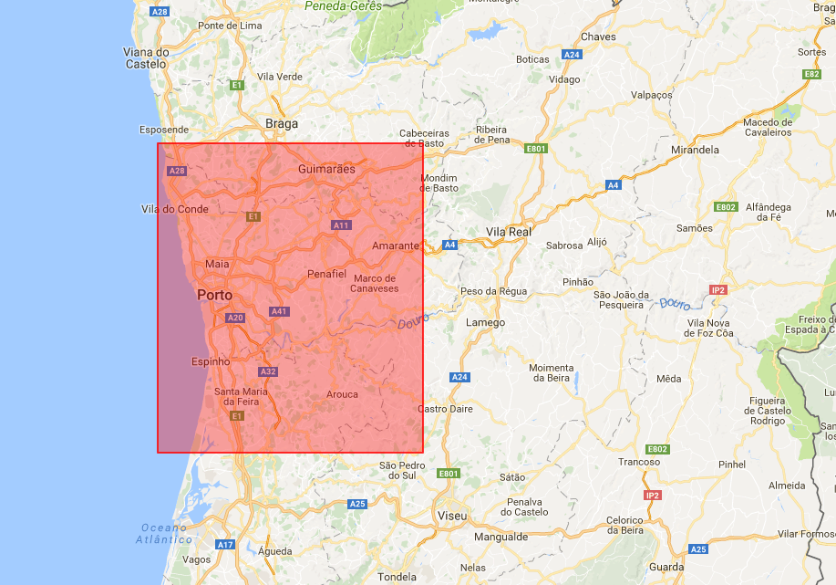
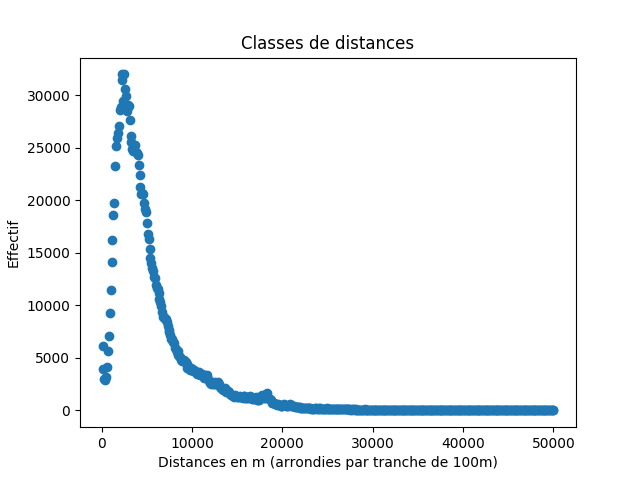
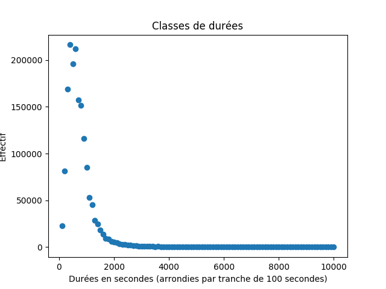
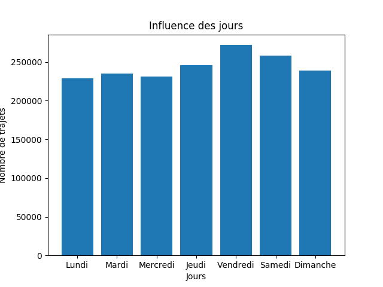
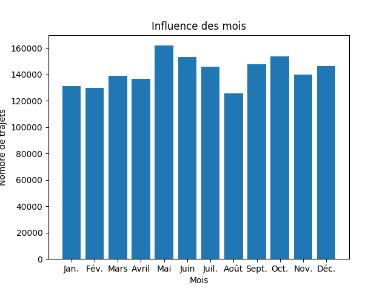
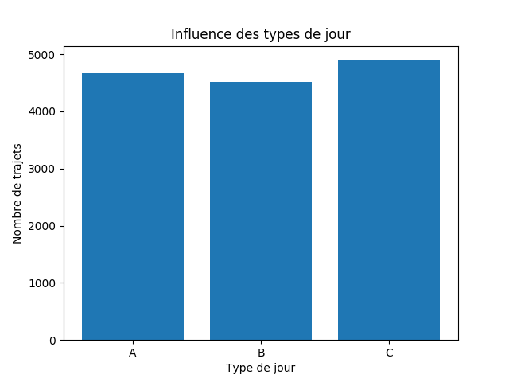
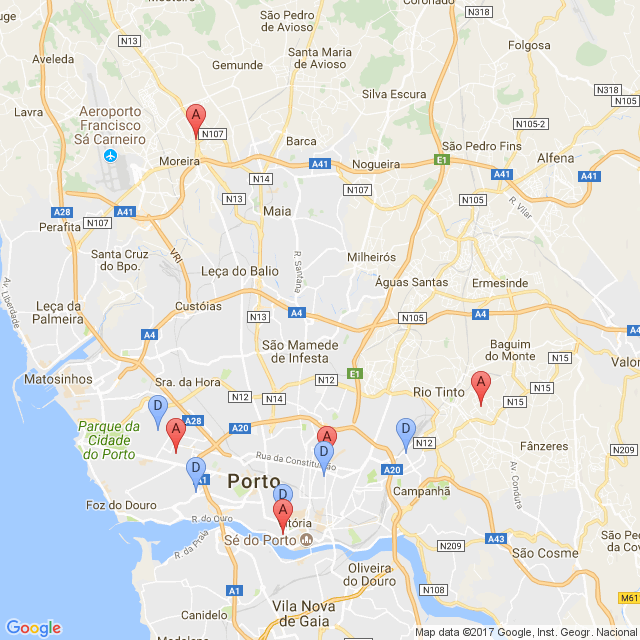
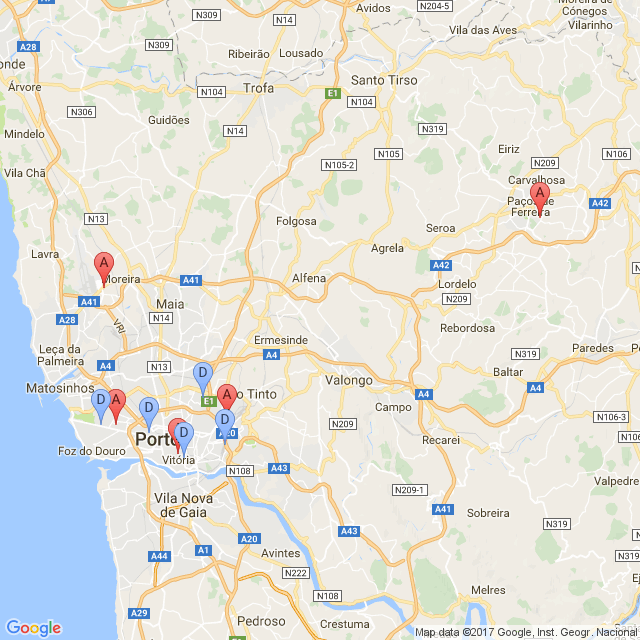
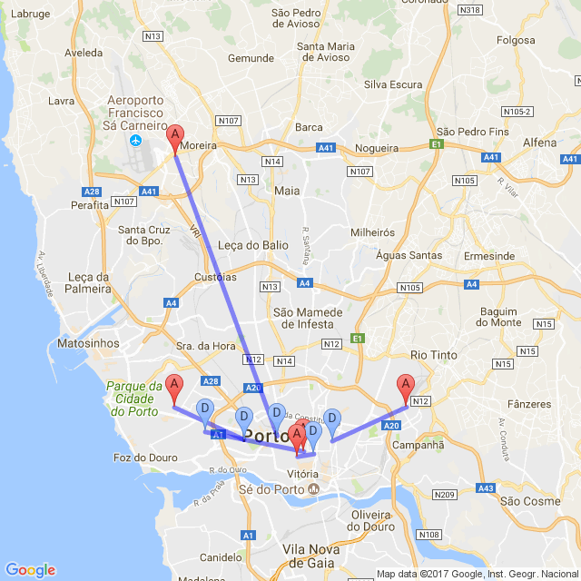
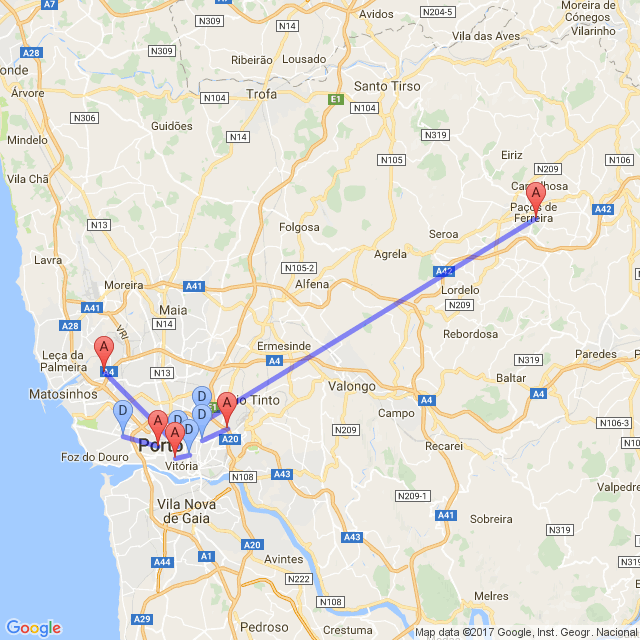

**Benjamin RIVIERE, GI04**

# Les trajets des taxis à Porto

## Introduction

L'objectif de ces séances de TD a été de mettre en place un *data warehouse* sous Cassandra, SGBD orienté colonne. Pour beaucoup, cela a été une première approche du NoSQL.

Le jeu de données utilisé est [l'ensemble des trajets des taxis](https://archive.ics.uci.edu/ml/datasets/Taxi+Service+Trajectory+-+Prediction+Challenge,+ECML+PKDD+2015) de la ville de Porto (Portugal) sur 1 an (entre début Juillet 2013 et fin Juillet 2014). 

Premièrement, il a fallut cibler les questions auxquelles on souhaitait répondre afin de concevoir le modèle de données. Une fois le modèle de données réalisé, il a fallut l'implémenter. Bien entendu, des données pouvaient être erronées ou manquantes, il a donc fallut les nettoyer.

Le traitement des données s'effectue via Python 3.

## Description des données

En regardant les données, nous pouvons faire plusieurs remarques intéressantes :

* Les IDs des courses sont de la forme `TIMESTAMP + '6' + TAXI_ID` où `+` représente l'opérateur de concaténation.
* Les coordonnées ne sont pas dans un format usuel (généralement `[latitude, longitude]`), elles sont représentées par le couple `[longitude, latitude]`. Il faudra prendre en compte cette particularité si l'on souhaite représenter les trajets sur un fond de carte par exemple.
* Les coordonnées couvertes par les trajets vont bien plus loin que la ville de Porto elle-même. On remarque que certains trajets terminent dans des villes alentour. Pour gagner en précision, nous avons choisit de ne pas assimiler la surface de la ville à un plan mais de bien considérer la "sphéricité" (relative) de la Terre. 
* Les coordonnées (latitude ou longitude) sont parfois proche d'un trajet à un autre, sans pour autant être identiques. Nous avons donc regroupé les coordonnées par "zone". Le regroupement par zone s'effectue en arrondissant les coordonnées à la 3ème décimale. Cela correspond environ à des rectangles de 100 x 85m.
* Certaines données sont aberrantes (des points au milieu de l'Océan par exemple).
* Certaines données ont été mal calculées (le type de jour par exemple).
* Certains trajets ont des données manquantes.

## Quelques questions

Comme nous l'avons dit, la conception du modèle de données dépend intimement des questions auxquelles nous souhaitons apporter une réponse. Voici quelques questions auxquelles nous aimerions pouvoir répondre :

* Quels sont les taxis les plus utilisés ?
* Quel est le type de course le plus populaire ?
* Quels sont les jours d'affluence ?
* Quelles sont les semaines d'affluence ?
* Quelles sont les heures d'affluence ?
* Quelles sont les zones de départ les plus populaires ?
* Quelles sont les zones d'arrivée les plus populaires ?
* Quelle est la distance moyenne d'un trajet ?
* Quelle est la durée moyenne d'un trajet ?

Cette liste de questions n'est bien entendu pas exhaustive. 

## Modèle conceptuel

Afin de répondre à nos différentes questions, nous proposons les dimensions (ainsi que les différentes hiérarchies qui en découlent) suivantes :

* **Temps**(année, mois, jour, heure, minutes, secondes, jourDeLaSemaine, semaine, période, typeDeJour)
* **Lieux**(zoneLon, zoneLat, lon, lat)
* **Courses**(tripID, taxiID, typeAppel, origineAppel, origineStand)

L'attribut *période* de la dimension **Temps** est une chaîne de caractères représentant le moment de la journée (matin, midi, après-midi, soirée, etc.). Il n'est pas utilisé pour le moment mais peut faire plus tard l'objet d'une interrogation.

Les faits sont liés aux dimensions précédentes. Pour la dimension **Lieux**, le lien est double car on a un lieu de départ et un lieu d'arrivée :
**Faits**(moment, course, départ, arrivée, durée, distance)

On peut synthétiser ce modèle via le schéma suivant.


## Implémentation réelle

### Idée générale

Le SGBD utilisé étant Cassandra (qui pousse à la dénormalisation), il y a une différence importante entre le modèle conceptuel de données et le modèle réel. Afin de faciliter les requêtes et l'exploitation des données via Python par la suite, nous avons choisit d'avoir une implémentation très redondante. Toutes les dimensions et les faits sont regroupées au sein d'une seule "table". 


### Tables sous Cassandra

Etant donné que l'on souhaite répondre à plusieurs questions qui nécessitent parfois des agrégations, on a plusieurs "tables" partitionnées et clusterisées différemment. 

Certains attributs sont probablement inutiles mais on a choisit de les laisser car on pourrait en avoir besoin par la suite (pour répondre à des questions auxquelles on n'aurait pas pensé). 

Pour bien répartir les données entre les différents de noeuds de Cassandra, il est important de faire en sorte de ne pas avoir des partitions trop grandes ou trop petites. Au sein d'une partition, les données sont organisées selon les *clusters* définis, ils sont donc important également.

Par exemple, on a créé une première "table" de faits qui partitionne les faits par jour. 

```cql
CREATE TABLE IF NOT EXISTS e21.facts_by_day (
    start_zone_lon FLOAT,
    start_zone_lat FLOAT,
    arrival_zone_lon FLOAT,
    arrival_zone_lat FLOAT,
    taxi_id INT,
    trip_id BIGINT,
    call_type TEXT,
    origin_call TEXT,
    origin_stand TEXT,  
    year INT,
    month INT,
    day INT,
    hour INT,
    minutes INT,
    seconds INT,
    day_of_week INT,
    week INT,
    period TEXT,
    day_type TEXT,  
    start_lon FLOAT,
    start_lat FLOAT,
    arrival_lon FLOAT,
    arrival_lat FLOAT,
    duration INT,
    distance FLOAT, 
    PRIMARY KEY ((year, month, day), hour, minutes, seconds, trip_id)
);
```

On a donc la clef de partition suivante : `(year, month, day)`. Elle nous permet de partitionner par jour. Les données sont clusterisées selon l'heure, les minutes et les secondes (dans un premier temps). Un problème que l'on peut rencontrer sous Cassandra est au moment de l'insertion des données. En effet, si une données existe déjà, elle sera mise à jour de manière silencieuse. Afin de lever cette ambiguité, on clusterise également les données selon l'ID du trajet. Cette clef primaire nous permet également de pouvoir faire des agrégat (manuellement) sur les mois ou les années par exemple.

De même, on a définit plusieurs autres "tables" de faits pour répondre à d'autres questions : 

* Une table de faits par zone de départ
* Une table de faits par zone d'arrivée
* Une table de faits par taxi
* Une table de faits par distance
* Une table de faits par durée
* Une table de faits par jour de la semaine
* Une table de faits par type de jour

Pour la partition par zone de départ, on procède de la façon suivante : `PRIMARY KEY ((start_zone_lon, start_zone_lat), year, month, day, minutes, seconds, trip_id)`.
On a donc une partition sur la longitude et la latitude de la zone de départ. Le reste de la partition est clusterisé par année, mois, jour, minutes, secondes et également par ID de trajet (pour lever les ambiguités encore une fois). On aurait pu ajouter l'année dans la clef de partition afin de limiter la taille des partitions d'une année à l'autre. Néanmoins, le jeu de données ne couvre qu'une année donc on laissera l'année en *cluster*.

Il convient de prendre des précautions avec la table de faits partitionnée sur les distances car il est très probable que les distances des trajets soient toutes différentes. On aurait donc autant de partitions que de trajets, ce qui n'est pas souhaitable. Pour pallier ce problème, les faits sont partionnés par une distance arrondie, afin de regrouper les distances "semblables" (par tranche de 100m). On clusterise ensuite sur la distance réelle (avant de clusteriser sur d'autres attributs pour lever les ambiguités) : `PRIMARY KEY (truncated_distance, distance, year, month, day, minutes, seconds, trip_id)`. On a procédé pareil pour la table clusterisée par durée de trajet : les trajets sont partitionnés par durées "semblables" (par tranche de 100 secondes).

De même que pour la "table" de faits partionnée par jour, la "table" de faits partitionnée par jour de la semaine nous permet de faire des agrégats sur le jour de la semaine, la semaine ou l'année. 

## Traitement des données

Comme expliqué précédemment, certaines données étaient erronées ou mal calculées. Il a donc fallu corriger tout cela. 

#### Type de jour

Dans l'énoncé du jeu de données, il nous est indiqué que ce champ a été mal calculé. Ce champ prend plusieurs valeurs en fonction de la date du jour correspondant :

* Type **B** : Le trajet a démarré pendant un jour de vacances ou un jour spécial (jour férié, etc.).
* Type **C** : Le trajet a démarré pendant un jour précédant un jour de type B.
* Type **A** : Les autres jours (même le week-end).

Dans un premier temps, on a récupéré les jours des vacances au Portugal pour l'année [2013](http://holidays.retira.eu/archive/portugal/2013/) et [2014](http://holidays.retira.eu/archive/portugal/2014/). Dans ces listes, il y a des jours normaux ou des fêtes régionales. Il faut donc faire le tri. Nous n'avons conservé que les vacances nationales. 

Par la suite, il suffit de comparer la date issue du *timestamp* de chaque trajet avec cette liste de dates (et les jours qui les précèdent) pour déterminer le type de jour.

#### Coordonnées

Pour cibler les données aberrantes, on choisit de définir une zone où les données sont considérées comme valides. En effet, un point au milieu de l'Océan n'a pas beaucoup de sens.

On choisit de resteindre la longitude à l'intervalle [-8,8; -8] et la latitude à l'interval [40,8; 41,5]. Cela correspond au rectangle rouge sur le fond de carte suivant. On observera par la suite qu'il faudrait peut-être retravailler cette surface de sélection.



#### Calculs

Dans le jeu de données, on ne dispose ni de la distance des trajets, ni de leur durée. Il faut donc les calculer. On effectue ces calculs dans le cas où l'attribut `MISSING_DATA` faut `False` (pas de données manquantes) et la longueur du polyline (coordonnées des étapes du trajet) est supérieure à 1. 

On sait que l'on a une coordonnées toutes les 15 secondes dans un trajet. La longueur d'un trajet en secondes se calcule donc par `15 * (n - 1)` (avec `n` la longueur du polyline d'un trajet).

Pour la distance, il suffit de calculer la distance entre les points successifs puis de sommer les distances obtenues. 

## Requêtes et résultats

Voici quelques exemples de requêtes possibles. Cela présente des résultats très généraux et ne répond pas à toutes les questions posées précédemment. Il s'agit plutôt d'un aperçu de ce qu'il est possible de faire avec le modèle. Il est possible de croiser des données, en ciblant des attributs particuliers. 

#### Les "classes" de distance

Ici, les distances sont partitionnées aux 100 mètres près. 

```cql
SELECT truncated_distance, COUNT(*)
FROM e21.facts_by_distance
GROUP BY truncated_distance;
```

On peut représenter ces données sous forme graphique (ici pour les courses entre 0 et 50km). Cela semble suivre une loi de Poisson (mais cela reste à démontrer).



On peut également calculer la distance moyenne parcourue. Elle est de 5,39 km. 

#### Les "classes" de durée

Ici, les données sont partitionnées par tranche de 100 secondes (1 minute et 40 secondes). C'était la méthode la plus simple pour arrondir les durées. On aurait pu faire des partitions différentes, à la minute par exemple.

```cql
SELECT truncated_duration, COUNT(*)
FROM e21.facts_by_duration
GROUP BY truncated_duration;
```

On remarque que là aussi que cela semble suivre une loi de Poisson.



De même, on peut calculer la durée moyenne d'une course. Elle est de 716 secondes (11 minutes et 56 secondes).

#### L'affluence en fonction du temps

On peut s'intéresser aux nombre de trajets total par jour (affluence cumulée). 

```cql
SELECT day_of_week, COUNT(*)
FROM e21.facts_by_week_day
GROUP BY year, week, day_of_week;
```

Le résultat retourné par cette requête est un agrégat du nombre de trajets par an par semaine par jour de la semaine. Il faut donc agréger de nouveau sur le jour de la semaine (on ne travaille que sur un an de données).

Si l'on représente le résultat à l'aide d'un diagramme en barre, on remarque que les jours de plus forte affluence sont le vendredi et le samedi. Cela paraît logique car cela est souvent les jours où les gens sortent et on besoin de se déplacer. Les 3 premiers jours de la semaine ayant une affluence stable, on peut penser que cela correspond aux gens qui partent travailler (tandis qu'en fin de semaine, ils partent en week-end ou vont faire la fête par exemple). On s'est intéressé à un résultat cumulé mais on aurait aussi pu regarder les moyennes journalières.



**Note :** On pourra utiliser la même table pour faire des calculs sur les semaines. Il suffira alors de faire les aggrégations à la main ! Cela n'a pas forcément d'intérêt ici dans la mesure où nous allons regarder le nombre de trajet par mois, résultat sûrement plus parlant. 

On peut également s'intéresser au nombre de trajets par mois. De même que pour les jour de la semaine, on obtient un résultat par année par mois par jour. Il faut donc agréger sur les mois à la main.

```cql
SELECT month, COUNT(*)
FROM e21.facts_by_day
GROUP BY year, month, day;
```

On obtient alors le diagramme en barres suivant. On remarque un creux en Août. On peut donc penser que les gens sont en vacances et ne prennent plus le taxi pour aller travailler. Les pics correspondent probablement à l'affluence de touristes.



On peut également s'intéresser à l'afluence en fonction du type de jour. On a alors besoin de faire deux requêtes. Une première pour connaitre le nombre de jour par type de jour et une seconde pour récupérer le nombre total de trajets par type de jour. 

```cql
-- Récupérer les jours (il faudra agréger à la main)
SELECT day, day_type
FROM e21.facts_by_day
GROUP BY year, month, day;
```

```cql
-- Récupérer le nombre de trajets par type de jours (il faudra agréger à la main)
SELECT day_type, COUNT(*) AS nb
FROM e21.facts_by_day_type
GROUP BY year, month, day_type;
```

On remarque alors que les jours précédant un jour férié (type **C**) sont plus populaires. On peut sûrement expliqué cela par le fait que les gens partent en vacances et doivent se rendre à l'aéroport ou à la gare par exemple. Au contraire, pendant les jours fériés (type **B**), les gens ne sont pas forcément présents en ville et n'utilisent pas les taxis. Néanmoins, la variation reste faible donc cela reste très hypothétique. 



#### Lieux de départ ou d'arrivées les plus populaires

Notre implémentation nous permet de faire ce type de requêtes. On obtiendrait les zones (pavés de 100 x 85m) les plus "utilisées". Néanmoins, ce n'est pas forcément très représentatif d'une tendance. Nous étudierons donc cet aspect à l'aide d'un classifieur par la suite. 

#### Les taxis les plus utilisés

A l'aide de la table partionnée selon les taxis, il est possible de faire des requêtes relatives aux taxis. Selon les requêtes, il faudra agréger ou non à la main. Par exemple, nous allons chercher les 10 taxis les plus utilisés.

```cql
SELECT taxi_id, COUNT(*) 
FROM e21.facts_by_taxi 
GROUP BY taxi_id;
```

| Position | Taxi | Nombre de trajets |
|:--------:|:----:|:-----------------:|
|    1     | 20000080 | 10731         |
|    2     | 20000403 | 9237          |
|    3     | 20000066 | 8443          |
|    4     | 20000364 | 7821          |
|    5     | 20000483 | 7729          |
|    6     | 20000129 | 7608          |
|    7     | 20000307 | 7497          |
|    8     | 20000621 | 7276          |
|    9     | 20000089 | 7266          |
|    10    | 20000424 | 7176          |

Encore une fois, il est possible de raisonner sur plusieurs attributs différents. On pourrait faire un classement sur les taxis qui parcourt le plus de distance.

## Classification 

#### Première approche

A présent, on se focalise sur un problème de classification. On peut se dire qu'en "découpant" notre ensemble de départs ou d'arrivées en K classes, les K centroïdes de ces classes représenteraient les points de départ ou d'arrivée les plus courants. Il faudra tenir compte de la dispersion de chaque classe.

Nous allons donc lancer un algorithme *k-means* sur nos lieux de départ et d'arrivée pour *k* = 5 afin d'obtenir les 5 lieux les plus populaires. Nous utiliserons la librairie Python `sklearn` qui offre plusieurs algorithmes de classification dont *k-means*. Elle est relativement facile d'utilisation.

On récupère les données des positions de départ de cette façon :

```cql
SELECT start_lon, start_lat
FROM e21.facts_by_start_zone;
```  

En faisant un apprentissage sur 100 000 trajets, on obtient les centres d'inerties suivants. Les marqueurs D bleus représentent les centroïdes des zones de départ et les A rouges les centroïdes des zone d'arriv&e.



En regardant plus précisemment sur Google Maps (ou autre), on observe que bien souvent ces centres sont proches d'une église, d'un hôpital, d'une grande école ou d'un quartier résidentiel important. On remarque également un point d'arrivée à côté de l'aéroport de Porto. 

En lançant une classification sur le jeu de données totale, on obtient quelque chose de similaire. On note la présence d'une classe un peu aberrante. Il est probable que ce soit un trajet unique dont la destination est trop écartée des autres points pour pouvoir être classifiée dans une autre classe. C'est tout de même un trajet de 40km et il n'y a pas grand chose à cet endroit qui justifie un tel trajet régulier. Il faut sûrement revoir le rectangle de recherche définit précédemment.



### Seconde approche

A présent, on souhaite chercher les trajets *k* les plus représentatifs. On va donc appliquer *k-means* dans un espace de dimension 4 (départ + arrivée). Dans un soucis d'optimisation, on implémentera l'algorithme nous-même cette fois afin de ne pas charger toutes les données en mémoire (*online k-means*). Cette fois encore, on choisira *k = 5*. 

L'algorithme tel qu'il est implémenté est une première approche qui nécessiterait d'être améliorée. On pourrait par exemple ajouter plusieurs initialisations des centroïdes afin de retenir la meilleure. Avec un seuil de 1e-3, il met entre 10 et 15 itérations à converger. 

En effectuant un premier test sur 100 000 trajets, on remarques certains patterns. Un trajet populaire semble être du centre-ville vers l'aéroport. Cela confirme ce que l'on avait observé précédemment. On remarque aussi des trajets qui vont de la banlieue vers le centre-ville et inversement. Cela est probablement les personnes qui se rendent au travail (ou en repartent). 



Voici les trajets populaires sur le jeu de données complet. Encore une fois, on retrouve le point "aberrant" sur le côté. Il est intéressant de noter que l'un des trajet est semblable à un autre trajet sur la carte précédente mais dans l'autre sens. Cela nous montre bien que la classification est arbitraire et que les trajets ont tendance (peut-être pas tous) à s'effectuer dans les deux sens. 



## Conclusion

Ce projet a permis une première approche du NoSQL ainsi que des avantages, mais aussi des contraintes, qu'il apporte. Si l'on a pu faire quelques observasions, voire tirer quelques conclusions, il est évident qu'il faudrait pousser les recherches plus loin. Le modèle de données et sa haute redondance en base de données permet de rapidement répondre à des questions auxquelles on n'aurait pas pensé de prime abord (si tenté que l'agrégat visé existe). En couplant cela à la puissance de Python, il y a encore beaucoup à faire.

## Annexes

L'archive jointe comprends les différents codes utilisés dans le projet.