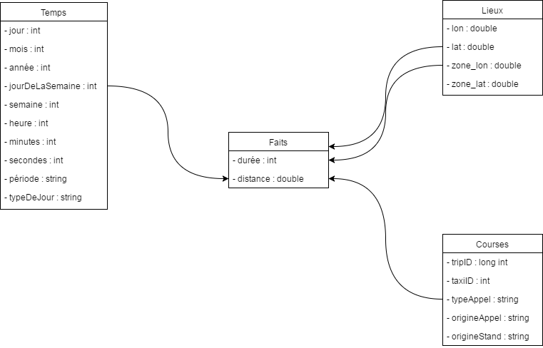

# TD 6

Ajouter pistes, explorations, idées qu'on a eu
Expliquer les problèmes, les solutions apportées
Qualité rédactionnelle prise en compte faiblement 


Lien vers le dataset : [https://archive.ics.uci.edu/ml/datasets/Taxi+Service+Trajectory+-+Prediction+Challenge,+ECML+PKDD+2015](https://archive.ics.uci.edu/ml/datasets/Taxi+Service+Trajectory+-+Prediction+Challenge,+ECML+PKDD+2015)

Fichier de données : `/train.csv` (1710671 lignes : `wc -l /train.csv`)

Lecture du fichier : `less -S /train.csv`

Vacances au Portugal en 2013 : [http://holidays.retira.eu/archive/portugal/2013/](http://holidays.retira.eu/archive/portugal/2013/)
Vacances au Portugal en 2014 : [http://holidays.retira.eu/archive/portugal/2014/](http://holidays.retira.eu/archive/portugal/2014/)

Il semble que les IDs des courses soient de la forme : `TIMESTAMP + '6' + TAXI_ID` (où + définit la concaténation).

Les coordonnées sont de la forme [LONGITUDE, LATITUDE].

Calcule une distance entre deux coordonées : 
\\[
    \sqrt[]{\left(\frac{lat_1 - lat_2}{360} . 2 \pi . R_T \right)^2 + \left(\frac{lon_1 - lon_2}{360} . 2 \pi . R_T . cos\left(\frac{lat_1 + lat_2}{360} . \pi \right)\right)^2}
\\]

Modélisation CASSANDRA : 

* [http://ippon.developpez.com/tutoriels/nosql/cassandra/modelisation-cassandra/](http://ippon.developpez.com/tutoriels/nosql/cassandra/modelisation-cassandra/)
* [http://datascale.io/cassandra-partitioning-and-clustering-keys-explained/](http://datascale.io/cassandra-partitioning-and-clustering-keys-explained/)

Exemple d'affichage de polyline : [http://jsfiddle.net/fv68j9h9/](http://jsfiddle.net/fv68j9h9/)

Rectangle : [http://jsfiddle.net/fv68j9h9/](http://jsfiddle.net/fv68j9h9/)

Rapport : Information techniques, peut être très court comme très long ! Expliquer un peu les choix, il ne s'agit pas d'un rapport de data warehouse.

## Attribute Information:

Each data sample corresponds to one completed trip. It contains a total of 9 (nine) features, described as follows:

**TRIP_ID:** (*String*) It contains a unique identifier for each trip;

**CALL_TYPE:** (*char*) It identifies the way used to demand this service. It may contain one of three possible values:
- 'A' if this trip was dispatched from the central;
- 'B' if this trip was demanded directly to a taxi driver at a specific stand;
- 'C' otherwise (i.e. a trip demanded on a random street).

**ORIGIN_CALL:** (*integer*) It contains a unique identifier for each phone number which was used to demand, at least, one service. It identifies the trip's customer if CALL_TYPE='A'. Otherwise, it assumes a NULL value;

**ORIGIN_STAND:** (*integer*): It contains a unique identifier for the taxi stand. It identifies the starting point of the trip if CALL_TYPE='B'. Otherwise, it assumes a NULL value;

**TAXI_ID:** (*integer*): It contains a unique identifier for the taxi driver that performed each trip;

**TIMESTAMP:** (*integer*) Unix Timestamp (in seconds). It identifies the trip's start;

**DAYTYPE:** (*char*) It identifies the daytype of the trip's start. It assumes one of three possible values:
- 'B' if this trip started on a holiday or any other special day (i.e. extending holidays, floating holidays, etc.);
- 'C' if the trip started on a day before a type-B day;
- 'A' otherwise (i.e. a normal day, workday or weekend).

**IMPORTANT NOTICE:** This field has not been correctly calculated.

**MISSING_DATA:** (*Boolean*) It is FALSE when the GPS data stream is complete and TRUE whenever one (or more) locations are missing;

**POLYLINE:** (*String*): It contains a list of GPS coordinates (i.e. WGS84 format) mapped as a string. The beginning and the end of the string are identified with brackets (i.e. [ and ], respectively). Each pair of coordinates is also identified by the same brackets as [LONGITUDE, LATITUDE]. This list contains one pair of coordinates for each 15 seconds of trip. The last list item corresponds to the trip's destination while the first one represents its start.

## Quelques questions

* Taxis les plus utilisés ?
* Type de courses les plus populaires ?
* Meilleurs clients (basé sur le numéro de téléphone) ?
* Meilleurs stands ?
* Jours d'affluence (vacances, week-end, etc.) ?
* Heures d'affluence (matin, après-midi, soir, etc.) ?
* Lieux de départ les plus populaires ? (faire un pavé ? Peut-être réduire les lieux à des zones)
* Lieux d'arrivée les plus populaires ?

## Modèle conceptuel

On propose les dimension suivantes (ainsi que les hiérarchies associées) :

* **Temps**(timestamp, date, jour, mois, année, jourDeLaSemaine, semaine, heure, minutes, période, typeDeJour)
* **Lieux**(lon, lat, zone_lon, zone_lat)
* **Courses**(id, taxi, typeDAppel, origineDAppel, standDOrigine)

**Faits :** (temps, trajet, départ, arrivée, duree, distance)



Pavé : couple latitude/longitude du couple en bas à gauche par exemple

## Exemples de requêtes

### Courses 

```cql
SELECT origin_stand, COUNT(*) 
FROM e21.trips_by_origin_stand
GROUP BY origin_stand;
```

```cql
SELECT *
FROM e21.trips_by_call_type
WHERE call_type = 'c';
```

```cql
SELECT *
FROM e21.trips_by_taxi
WHERE taxi_id = 20000156;
```

### Lieux

```cql
SELECT *
FROM e21.locations_by_lon
WHERE zone_lon = -8.6;
```

```cql
SELECT * 
FROM e21.locations_by_zone 
WHERE zone_lon = -8.6 
AND zone_lat = 41.16;
```

### Temps

```cql
SELECT * 
FROM e21.time_by_month
WHERE month = 2;
```

```cql
SELECT *
FROM e21.time_by_day_of_week
WHERE day_of_week = 6
AND (week, hour) > (0, 12);
```

### Faits

```cql
SELECT *
FROM e21.facts_by_duration
WHERE duration = 660;
```